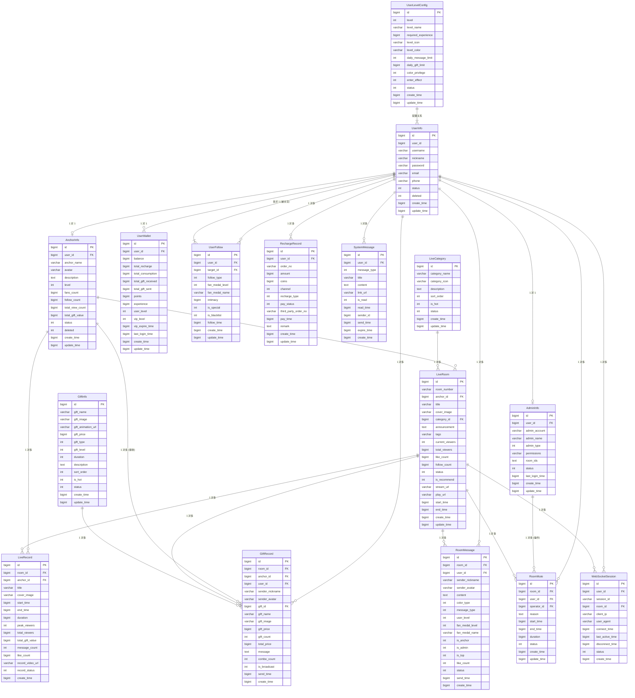

# 私域直播平台 - 数据库 ER 图

## 实体关系图

```mermaid

erDiagram
    UserInfo ||--o| AnchorInfo : "1 对 1"
    UserInfo ||--o| AdminInfo : "1 对 1"
    UserInfo ||--o{ UserWallet : "1 对 1"
    UserInfo ||--o{ UserFollow : "1 对多"
    UserInfo ||--o{ RoomMessage : "1 对多"
    UserInfo ||--o{ GiftRecord : "1 对多"
    UserInfo ||--o{ RechargeRecord : "1 对多"
    UserInfo ||--o{ RoomMute : "1 对多"
    UserInfo ||--o{ SystemMessage : "1 对多"
    UserInfo ||--o{ WebSocketSession : "1 对多"
    
    AnchorInfo ||--o{ LiveRoom : "1 对多"
    AnchorInfo ||--o{ LiveRecord : "1 对多"
    AnchorInfo ||--o{ GiftRecord : "1 对多 (接收)"
    
    AdminInfo ||--o{ RoomMute : "1 对多 (操作)"
    
    LiveCategory ||--o{ LiveRoom : "1 对多"
    
    LiveRoom ||--o{ LiveRecord : "1 对多"
    LiveRoom ||--o{ RoomMessage : "1 对多"
    LiveRoom ||--o{ GiftRecord : "1 对多"
    LiveRoom ||--o{ RoomMute : "1 对多"
    LiveRoom ||--o{ WebSocketSession : "1 对多"
    
    GiftInfo ||--o{ GiftRecord : "1 对多"
    
    UserFollow }|--|| UserInfo : "多对 1 (被关注)"
    
    UserLevelConfig ||--|{ UserInfo : "配置关系"
    
    UserInfo {
        bigint id PK
        bigint user_id
        varchar username
        varchar nickname
        varchar password
        varchar email
        varchar phone
        int status
        int deleted
        bigint create_time
        bigint update_time
    }
    
    AnchorInfo {
        bigint id PK
        bigint user_id FK
        varchar anchor_name
        varchar avatar
        text description
        int level
        bigint fans_count
        bigint follow_count
        bigint total_view_count
        bigint total_gift_value
        int status
        int deleted
        bigint create_time
        bigint update_time
    }
    
    AdminInfo {
        bigint id PK
        bigint user_id FK
        varchar admin_account
        varchar admin_name
        int admin_type
        varchar permissions
        text room_ids
        int status
        bigint last_login_time
        bigint create_time
        bigint update_time
    }
    
    LiveCategory {
        bigint id PK
        varchar category_name
        varchar category_icon
        text description
        int sort_order
        int is_hot
        int status
        bigint create_time
        bigint update_time
    }
    
    LiveRoom {
        bigint id PK
        varchar room_number
        bigint anchor_id FK
        varchar title
        varchar cover_image
        bigint category_id FK
        text announcement
        varchar tags
        int current_viewers
        bigint total_viewers
        bigint like_count
        bigint follow_count
        int status
        int is_recommend
        varchar stream_url
        varchar play_url
        bigint start_time
        bigint end_time
        bigint create_time
        bigint update_time
    }
    
    LiveRecord {
        bigint id PK
        bigint room_id FK
        bigint anchor_id FK
        varchar title
        varchar cover_image
        bigint start_time
        bigint end_time
        bigint duration
        int peak_viewers
        bigint total_viewers
        bigint total_gift_value
        int message_count
        bigint like_count
        varchar record_video_url
        int record_status
        bigint create_time
    }
    
    RoomMessage {
        bigint id PK
        bigint room_id FK
        bigint user_id FK
        varchar sender_nickname
        varchar sender_avatar
        text content
        int color_type
        int message_type
        int user_level
        int fan_medal_level
        varchar fan_medal_name
        int is_anchor
        int is_admin
        int is_top
        int like_count
        int status
        bigint send_time
        bigint create_time
    }
    
    GiftInfo {
        bigint id PK
        varchar gift_name
        varchar gift_image
        varchar gift_animation_url
        bigint gift_price
        int gift_type
        int gift_level
        int duration
        text description
        int sort_order
        int is_hot
        int status
        bigint create_time
        bigint update_time
    }
    
    GiftRecord {
        bigint id PK
        bigint room_id FK
        bigint anchor_id FK
        bigint user_id FK
        varchar sender_nickname
        varchar sender_avatar
        bigint gift_id FK
        varchar gift_name
        varchar gift_image
        bigint gift_price
        int gift_count
        bigint total_price
        text message
        int combo_count
        int is_broadcast
        bigint send_time
        bigint create_time
    }
    
    UserFollow {
        bigint id PK
        bigint user_id FK
        bigint target_id FK
        int follow_type
        int fan_medal_level
        varchar fan_medal_name
        bigint intimacy
        int is_special
        int is_blacklist
        bigint follow_time
        bigint create_time
        bigint update_time
    }
    
    UserWallet {
        bigint id PK
        bigint user_id FK
        bigint balance
        bigint total_recharge
        bigint total_consumption
        bigint total_gift_received
        bigint total_gift_sent
        bigint points
        bigint experience
        int user_level
        int vip_level
        bigint vip_expire_time
        bigint last_login_time
        bigint create_time
        bigint update_time
    }
    
    RechargeRecord {
        bigint id PK
        bigint user_id FK
        varchar order_no
        bigint amount
        bigint coins
        int channel
        int recharge_type
        int pay_status
        varchar third_party_order_no
        bigint pay_time
        text remark
        bigint create_time
        bigint update_time
    }
    
    RoomMute {
        bigint id PK
        bigint room_id FK
        bigint user_id FK
        bigint operator_id FK
        text reason
        bigint start_time
        bigint end_time
        bigint duration
        int status
        bigint create_time
        bigint update_time
    }
    
    SystemMessage {
        bigint id PK
        bigint user_id FK
        int message_type
        varchar title
        text content
        varchar link_url
        int is_read
        bigint read_time
        bigint sender_id
        bigint send_time
        bigint expire_time
        bigint create_time
    }
    
    WebSocketSession {
        bigint id PK
        bigint user_id FK
        varchar session_id
        bigint room_id FK
        varchar client_ip
        varchar user_agent
        bigint connect_time
        bigint last_active_time
        bigint disconnect_time
        int status
        bigint create_time
    }
    
    UserLevelConfig {
        bigint id PK
        int level
        varchar level_name
        bigint required_experience
        varchar level_icon
        varchar level_color
        int daily_message_limit
        bigint daily_gift_limit
        int color_privilege
        int enter_effect
        int status
        bigint create_time
        bigint update_time
    }
```