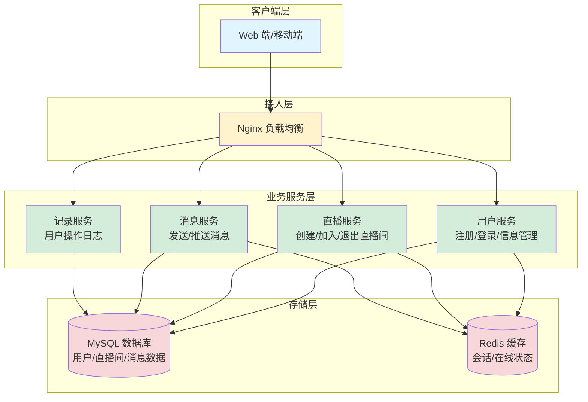

```mermaid

graph TB
    subgraph "客户端层"
        A[Web 端/移动端]
    end

    subgraph "接入层"
        B[Nginx 负载均衡]
    end

    subgraph "业务服务层"
        C1[用户服务<br/>注册/登录/信息管理]
        C2[直播服务<br/>创建/加入/退出直播间]
        C3[消息服务<br/>发送/推送消息]
        C4[记录服务<br/>用户操作日志]
    end

    subgraph "存储层"
        D1[(MySQL 数据库<br/>用户/直播间/消息数据)]
        D2[(Redis 缓存<br/>会话/在线状态)]
    end

    A --> B
    B --> C1
    B --> C2
    B --> C3
    B --> C4
    
    C1 --> D1
    C1 --> D2
    C2 --> D1
    C2 --> D2
    C3 --> D1
    C3 --> D2
    C4 --> D1

    style A fill:#e1f5ff
    style B fill:#fff3cd
    style C1 fill:#d4edda
    style C2 fill:#d4edda
    style C3 fill:#d4edda
    style C4 fill:#d4edda
    style D1 fill:#f8d7da
    style D2 fill:#f8d7da

```